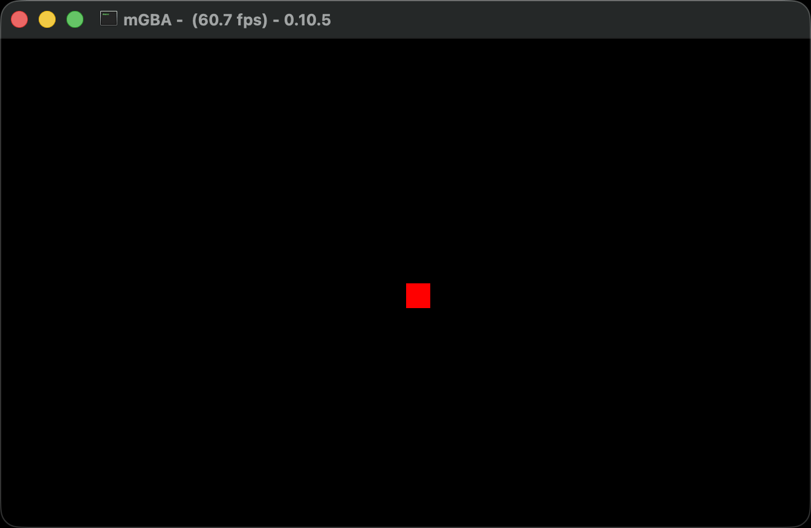

# GBA GIF Capture Tool

Cross-platform Rust tool that captures frames from mGBA windows and creates GIFs automatically for each binary in an agbrs project.



## Features

- Automatically discovers and builds binaries in `src/bin/` or `src/main.rs`
- Configurable GIF settings (FPS and duration)
- Parallel frame capture for fast execution
- Automatic mGBA window detection with retry logic
- Cross-platform support (macOS, Windows, Linux)
- GBA controller input sequences with customizable key mappings

## Roadmap

- [x] Before capture: configurable delays and button sequences
- [x] During capture: configurable delays and button sequences
- [ ] Configurable mGBA window size for capture

## Installation

For now this will not be published as a crate, so to install from the git repository:

```bash
cargo install --git https://github.com/zpg6/agbrs-capture
```

## Usage

Then you can run from your terminal like so:

```bash
# Run in current directory with defaults (10fps, 3 seconds)
agbrs-capture

# Run in specific directory
agbrs-capture /path/to/agbrs-project

# Custom settings
agbrs-capture --fps 15 --duration 2.5

# Custom settings with specific directory
agbrs-capture /path/to/agbrs-project --fps 15 --duration 2.5

# Get help
agbrs-capture --help
```

### Options

- `--fps <FPS>`: Frames per second for the output GIF (default: 10.0)
- `--duration <SECONDS>`: Duration of the GIF in seconds (default: 3.0)
- `--before-capture <SEQUENCE>`: Input sequence to execute before capture starts
- `--during-capture <SEQUENCE>`: Input sequence to execute during capture

### Input Sequences

Input sequences allow you to automate keystrokes before and during GIF capture. This is useful for:

- Navigating menus before recording
- Triggering animations or gameplay during capture
- Simulating user input for interactive demos

#### Sequence Format

Sequences are comma-separated actions in the format:

- `key` - Quick press and release (e.g., `A`, `space`, `enter`)
- `key:duration` - Hold key for specified milliseconds (e.g., `right:500`)
- `wait:duration` - Wait for specified milliseconds (e.g., `wait:1000`)

#### GBA Controller Keys

Use GBA button names that automatically map to your keyboard:

| GBA Button  | Key | Default Mapping |
| ----------- | --- | --------------- |
| A Button    | `A` | → `x`           |
| B Button    | `B` | → `z`           |
| D-pad Up    | `U` | → `up`          |
| D-pad Down  | `D` | → `down`        |
| D-pad Left  | `L` | → `left`        |
| D-pad Right | `R` | → `right`       |
| Start       | `S` | → `enter`       |
| Select      | `E` | → `backspace`   |
| L Shoulder  | `J` | → `a`           |
| R Shoulder  | `I` | → `s`           |

**Also supports raw keyboard keys**: `space`, `tab`, `escape`, `shift`, `ctrl`, `alt`, etc.

#### Examples

```bash
# Move square around during capture
agbrs-capture --during-capture "R:200,wait:300,D:200,wait:300,L:200,wait:300,U:200"

# Press A button, wait, then hold B button
agbrs-capture --before-capture "A,wait:1000,B:500"

# Navigate menu with D-pad, press Start, then simulate gameplay
agbrs-capture --before-capture "D,D,S,wait:1000" --during-capture "A:100,wait:300,B:100"
```

### Configuration File

For projects with multiple binaries or to save time on repeated captures, you can create a `capture.json` file in your project root. This is especially useful for `src/bin/` projects where each binary might need different input sequences:

```json
{
  "settings": {
    "key_mappings": {
      "a": "x",
      "b": "z",
      "up": "up",
      "down": "down",
      "left": "left",
      "right": "right",
      "start": "enter",
      "select": "backspace",
      "l_shoulder": "a",
      "r_shoulder": "s"
    }
  },
  "binaries": {
    "moving_square": {
      "before_capture": "wait:1000",
      "during_capture": "R:200,wait:300,D:200,wait:300,L:200,wait:300,U:200"
    },
    "moving_square_hold": {
      "during_capture": "R:500,wait:200,D:500,wait:200,L:500,wait:200,U:500"
    }
  }
}
```

**Configuration Priority:**

1. **CLI arguments** (`--before-capture`, `--during-capture`) - highest priority, overrides config file
2. **Binary-specific config** in `capture.json` (e.g., `"hello_world"`) - per-binary overrides
3. **Default config** in `capture.json` - fallback for all binaries
4. **No input sequences** - if nothing is configured anywhere

**Why use `capture.json`?**

- **GBA button names**: Use `A`, `B`, `U`, `D`, `R`, `L` instead of raw keyboard keys
- **Per-binary sequences**: Each game can have different input patterns
- **Custom key mappings**: Override defaults if your mGBA uses different keys
- **Time-saving**: No need to type long sequences on command line

**Priority order:**

1. CLI arguments override everything
2. Binary-specific config overrides global settings
3. Global settings provide defaults

This will:

1. Discover and pre-build all binaries in `src/bin/` or the main binary in `src/main.rs` (defaults to current directory)
2. Run each binary and wait for mGBA to start
3. Execute any before-capture input sequences (if specified)
4. Capture frames while executing during-capture input sequences (if specified)
5. Create GIF files in the `out/` folder

## License

[MIT](./LICENSE)

## Contributing

Contributions are welcome! Whether it's bug fixes, feature additions, or documentation improvements, we appreciate your help in making this project better. For major changes or new features, please open an issue first to discuss what you would like to change.
