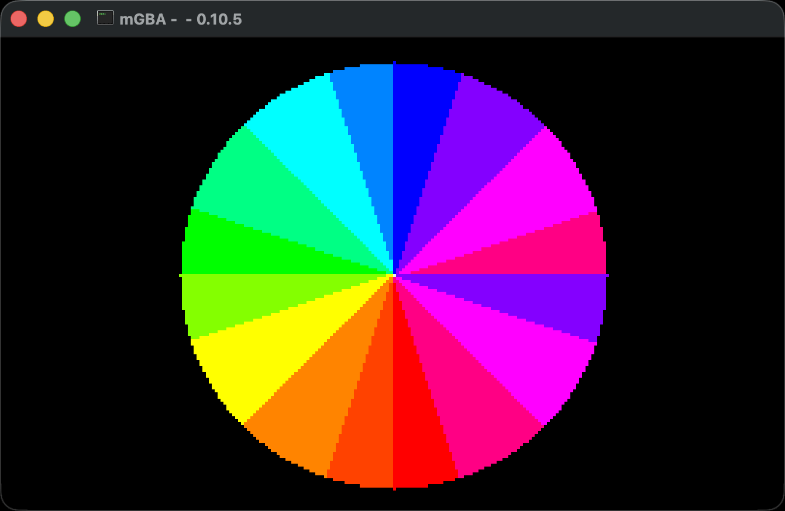

# GBA GIF Capture Tool

Cross-platform Rust tool that captures frames from mGBA windows and creates GIFs automatically for each binary in an agbrs project.



**Features:**

- Automatically discovers and builds all binaries in `src/bin/`
- Configurable GIF settings (FPS and duration)
- Parallel frame capture for fast execution
- Automatic mGBA window detection with retry logic
- Cross-platform support (macOS, Windows, Linux)

## Installation

Install as a global cargo command:

```bash
cargo install --path .
```

Or install from a git repository:

```bash
cargo install --git https://github.com/zpg6/agbrs-capture
```

## Usage

```bash
# Run in current directory with defaults (10fps, 3 seconds)
agbrs-capture

# Run in specific directory
agbrs-capture /path/to/agbrs-project

# Custom settings
agbrs-capture --fps 15 --duration 2.5

# Custom settings with specific directory
agbrs-capture /path/to/agbrs-project --fps 15 --duration 2.5

# Get help
agbrs-capture --help
```

### Options

- `--fps <FPS>`: Frames per second for the output GIF (default: 10.0)
- `--duration <SECONDS>`: Duration of the GIF in seconds (default: 3.0)

This will:

1. Discover and pre-build all binaries in `src/bin/` (defaults to current directory)
2. Run each binary and wait for mGBA to start
3. Capture frames and create GIF files in the `out/` folder

## License

[MIT](./LICENSE)

## Contributing

Contributions are welcome! Whether it's bug fixes, feature additions, or documentation improvements, we appreciate your help in making this project better. For major changes or new features, please open an issue first to discuss what you would like to change.
